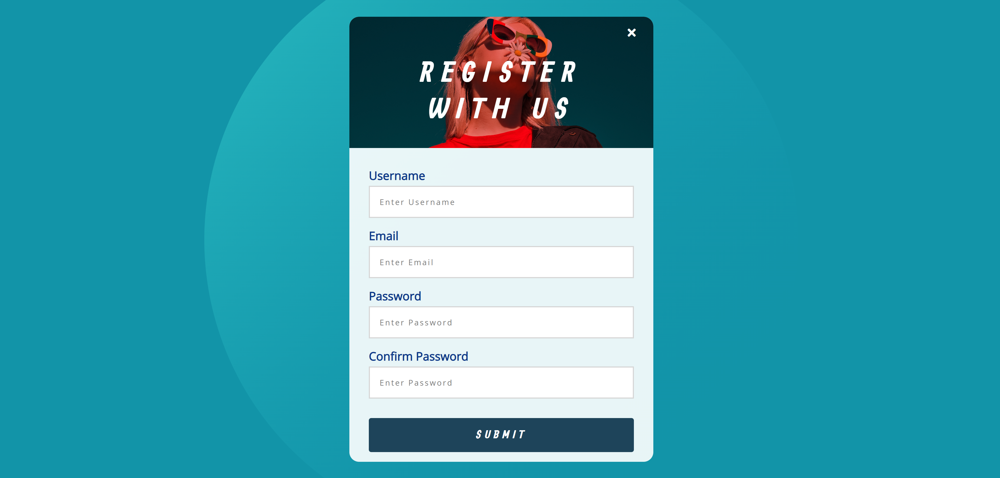

# Form Validation Project



## Welcome! 👋

Thanks for checking out this mini-project!

This is a one-step form validation component with username, email, and password input fields.

## Table of contents

- [Overview](#overview)
  - [The goal](#the-goal)
  - [Links](#links)
- [My process](#my-process)
  - [Built with](#built-with)
  - [What I learned](#what-i-learned)
- [Author](#author)

## The goal

The goal for this mini-project was to build out a form validation component with multiple input fields and custom functions for each. The project should also be visually appealing.

Your users should be able to:

- View the optimal layout for the component depending on their device's screen size
- See hover states for all interactive elements on the page
- See specific error messages when an input is invalid

## Links

Live Site URL: [https://juliawalton.github.io/form-validator/](https://juliawalton.github.io/form-validator/)

### Built with

- Semantic HTML5 markup
- CSS3
- Flexbox
- CSS Grid
- JavaScript
- Regular expressions

## What I learned

This project was useful for practicing creating custom validation for elements in a form. Each custom validity function calls an error or success function in response to a condition. This was critical to avoid rewriting code.

```js
function checkLength(input, min, max) {
  if (input.value.length < min) {
    showError(
      input,
      `${getFieldName(input)} must be at least ${min} characters`
    );
  } else if (input.value.length > max) {
    showError(
      input,
      `${getFieldName(input)} must be less than ${max} characters`
    );
  } else {
    showSuccess(input);
  }
}
```

## Author

- Website - [Julia's Portfolio](https://juliawalton.github.io/portfolio/)
- LinkedIn - [Julia Walton](https://www.linkedin.com/in/juliawalton/)
